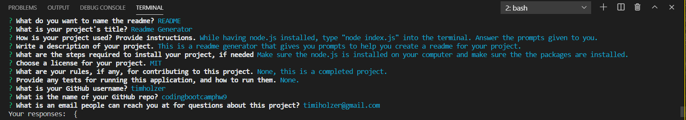

    # Readme Generator 
    
    This is a readme generator that gives you prompts to help you create a readme for your project.
    
    
* [Installation](#Installation)
    
* [Instructions](#Usage)
    
* [Contribution](#Contribution)
    
* [Tests](#Tests)
    
* [License](#License)
    
* [Author](#Author)    
    ## Installation
    Make sure the node.js is installed on your computer and make sure the the packages are installed.
    ## Instructions
    While having node.js installed, type "node index.js" into the terminal. Answer the prompts given to you. A video of the Readme Generator being used can be found at: https://youtu.be/WF3YTDGuG5g 
    ## Contribution
    None, this is a completed project.
    ## Tests
    None.
    ## License 
    This project is licensed under the MIT license
    ## Author 
    ## timholzer - Email: timiholzer@gmail.com - GitHub Repo: https://github.com/timholzer/codingbootcamphw9
    